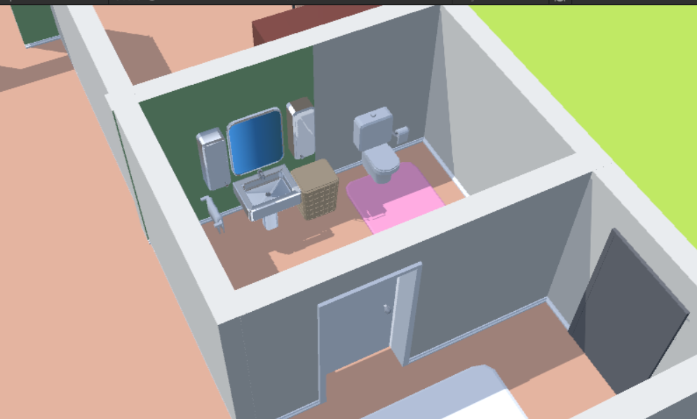

# Practice 2 - Game Programming
By: Zolboo Tumendemberel, 24110177

## Goal of the practice
The goal of this practice is to create a home model.

## Features, Explanation of the rooms
### Camera
With the imported script, you can freely move around the house to look at the items in the room using the keyboard and mouse movement.

### Entrance
The entrance area has a bathroom next to it.

### Living room, kitchen, & gaming area
The living room is connected to the kitchen area, with dining tables and kitchen furniture, also with the gaming area with multiple arcade cabinets and board game table

### Office & music room
The office has a table with PC, multiple bookshelves, and drum set for relaxation.

### Bedroom
The bedroom has an additional bathroom along with closet, mirror, rug.

## References
[Free Moving camera](https://assetstore.unity.com/packages/tools/camera/free-fly-camera-140739#description)

[Low poly furniture](https://assetstore.unity.com/packages/3d/props/furniture/low-poly-simple-furniture-free-240197)

[House Interior](https://assetstore.unity.com/packages/3d/props/interior/free-house-interior-223416)
