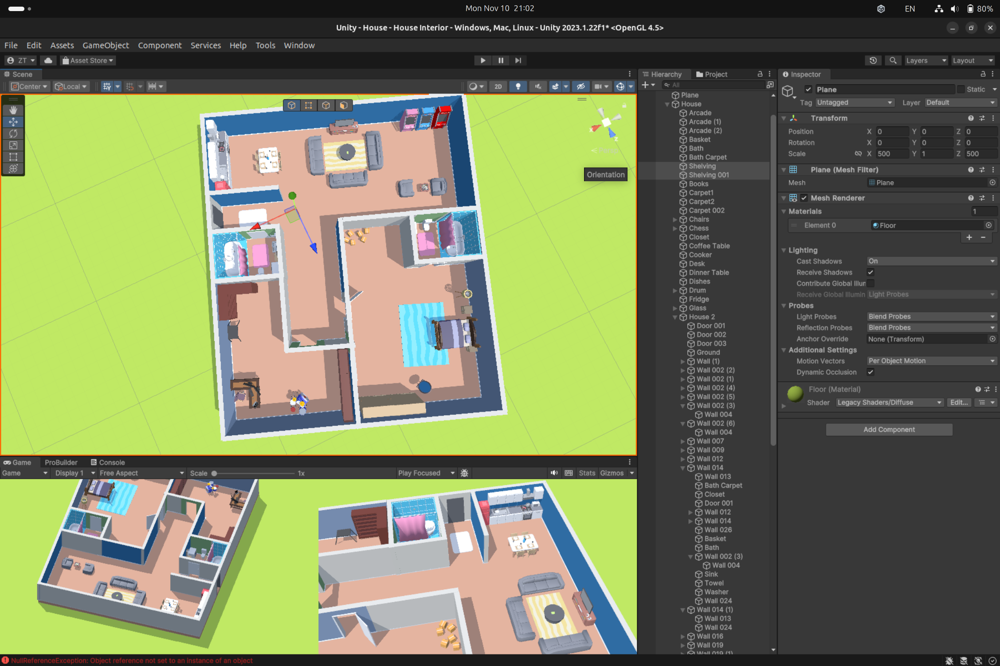

# Practice 2 - Game Programming
By: Zolboo Tumendemberel, 24110177

## Goal of the practice
The goal of this practice is to create a home model.

## Explanation of the rooms

### Entrance

## References
[Free Moving camera](https://assetstore.unity.com/packages/tools/camera/free-fly-camera-140739#description)

[Low poly furniture](https://assetstore.unity.com/packages/3d/props/furniture/low-poly-simple-furniture-free-240197)

[House Interior](https://assetstore.unity.com/packages/3d/props/interior/free-house-interior-223416)
